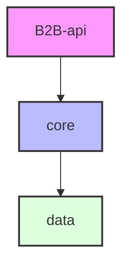

# Nexori 🚀

Este es el sistema backend de **Nexori**, una plataforma robusta y escalable para la gestión de operaciones B2B (Business-to-Business), diseñada bajo una arquitectura modular limpia con **Spring Boot** y **Java 21**. 

El sistema administra almacenes, productos, proveedores, órdenes de compra, facturación, esquemas de comisiones y pagos, además de contar con seguridad avanzada mediante JWT, autenticación en dos pasos (2FA/TOTP), soporte para WebSockets y programación de tareas agrupadas (Quartz Scheduler).

---

## 📂 Arquitectura del Proyecto (Multi-módulo)

El proyecto está estructurado en tres módulos principales de Maven para separar claramente las responsabilidades:



### 1. [`data`](file:///D:/UPB/CERTI3/B2B-Proyecto/data) (Capa de Acceso a Datos y Modelado)
* **Entidades JPA:** Modelos de base de datos definidos con Hibernate (por ejemplo, `Almacen`, `Empresa`, `OrdenCompra`, `Factura`, `Usuario`, etc.).
* **Repositorios:** Interfaces que heredan de `JpaRepository` para el acceso simplificado a PostgreSQL.
* **DTOs (Data Transfer Objects):** Clases estructuradas para el mapeo de peticiones (`request`) y respuestas (`response`), evitando exponer las entidades de base de datos directamente.

### 2. [`core`](file:///D:/UPB/CERTI3/B2B-Proyecto/core) (Capa de Lógica de Negocio e Integraciones)
* **Servicios:** Contiene la lógica transaccional y las reglas del negocio de cada entidad del sistema.
* **Integraciones Externas:**
  * **Stereum API:** Conectores para procesar transacciones y flujos de pago.
  * **TOTP/2FA:** Lógica de generación y validación de tokens multifactor.
* **Excepciones y Utilidades:** Manejadores de errores personalizados y herramientas auxiliares (exportación a CSV, generación de facturas, etc.).

### 3. [`B2B-api`](file:///D:/UPB/CERTI3/B2B-Proyecto/B2B-api) (Capa de Presentación y Puntos de Entrada)
* **Controladores REST:** Exposición de endpoints HTTP documentados para la comunicación con clientes externos.
* **Seguridad:** Configuración de Spring Security con filtros JWT para autenticación y autorización sin estado (stateless).
* **WebSockets:** Interceptores y configuraciones para comunicaciones bidireccionales en tiempo real.
* **Quartz Scheduler:** Configuración de tareas programadas (Jobs como `EmailSenderJob`) persistidas de forma distribuida en base de datos.

---

## 🛠️ Tecnologías Utilizadas

* **Java 21**
* **Spring Boot 4.0.6 (Spring Core, MVC, Security, Mail, Quartz)**
* **Spring Data JPA & PostgreSQL** (Driver oficial de PostgreSQL)
* **Caffeine Cache** (Caché local en memoria para usuarios y empresas)
* **Quartz Scheduler (Clustered)** (Programador de tareas con almacenamiento JDBC en PostgreSQL)
* **JWT (JSON Web Tokens)** & **TOTP** (Autenticación robusta y 2FA)
* **Lombok** (Reducción de código boilerplate)
* **OpenAPI/Swagger-UI** (Documentación de API interactiva)

---

## ⚙️ Configuración del Sistema

El archivo de configuración principal se ubica en [`application.properties`](file:///D:/UPB/CERTI3/B2B-Proyecto/B2B-api/src/main/resources/application.properties). Para que el sistema funcione correctamente, se deben proveer las siguientes variables de entorno:

| Variable de Entorno | Descripción | Ejemplo |
|---|---|---|
| `DATABASE_URL` | URL de conexión de PostgreSQL | `jdbc:postgresql://localhost:5432/b2b_db` |
| `DATABASE_USERNAME` | Usuario de la base de datos | `postgres` |
| `DATABASE_PASSWORD` | Contraseña del usuario de base de datos | `mi_password` |
| `B2B_SECRET_KEY` | Clave secreta para firmar los tokens JWT | *Clave secreta segura* |
| `STEREUM_API_KEY` | API Key para la pasarela de pagos Stereum | *API Key provista por Stereum* |
| `MAIL_SMTP_USERNAME` | Correo electrónico para el servicio SMTP | `ejemplo@gmail.com` |
| `MAIL_SMTP_PASSWORD` | Contraseña de aplicación del correo SMTP | `contraseña_de_aplicacion` |
| `AUTH_KEY` | Clave de cifrado de Jasypt para valores sensibles | *Llave de cifrado* |

---

## 🚀 Compilación y Ejecución

### Requisitos Previos
* **JDK 21** o superior instalado y configurado en el `PATH`.
* Una instancia de **PostgreSQL** activa con la base de datos creada.

### Paso 1: Clonar y Compilar
Asegúrate de estar en el directorio raíz del proyecto y compila utilizando el Maven Wrapper provisto:

```bash
# Compilar todo el proyecto y descargar dependencias
./mvnw clean install
```

### Paso 2: Configurar Variables de Entorno
Puedes configurar las variables de entorno en tu sistema operativo o crear un archivo `.env` en la ruta de ejecución de `B2B-api`.

### Paso 3: Ejecutar el Servidor
Para iniciar la aplicación Spring Boot desde el módulo ejecutable (`B2B-api`), ejecuta:

```bash
./mvnw -pl B2B-api spring-boot:run
```

El servidor web iniciará de manera predeterminada en el puerto **`8080`**.

---

## 📖 Documentación del API (Swagger)

Una vez que el servidor esté en ejecución, puedes explorar la documentación interactiva de la API ingresando a:

👉 **[http://localhost:8080/swagger-ui/index.html](http://localhost:8080/swagger-ui/index.html)**

Desde allí podrás visualizar todos los controladores y probar los diferentes métodos HTTP disponibles.
